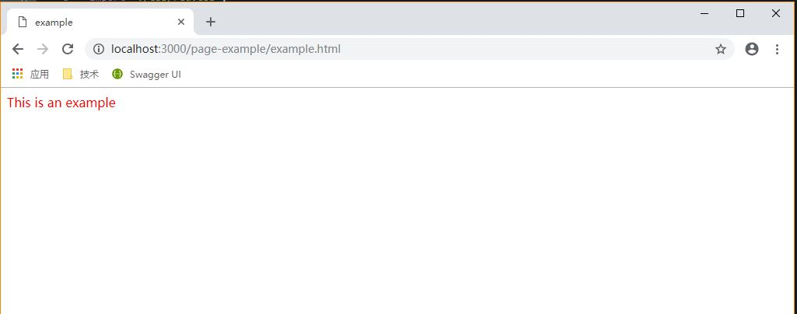
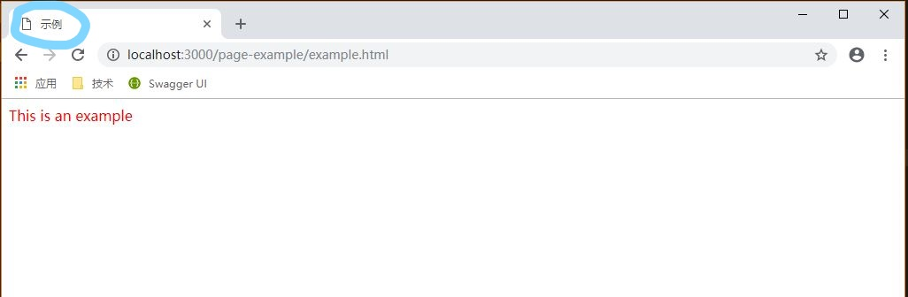

# webpack4 进阶之自动化
本文不是介绍webpack4的基础配置，而是对上文[webpack4 打包vue多页面](./doc/version1.md)的一个提升改进。
一般而言，配置文件是不允许改动的，但因为是多页面，同时还要用插件生成html，所以每次增加页面后需要在配置文件上添加一些信息，这对我们的开发工作带来了不方便。
究其原因，是我们无法在写配置文件的时候得到新增的文件路径、文件名、配置参数。因此这次我们利用Node API ，在编译
前动态得到新增的文件的相关属性。
## 1.用法
``` bash
$ git clone git@github.com:comWang/frontend-project-build.git
$ cd ./frontend-project-build
$ npm install
<!-- 开发模式 -->
$ npm run start
<!-- 生产模式 -->
$ npm run build
```
## 2. 概述
按照老规矩，先说最后实现的效果，再做介绍。这是整个项目结构：
``` 
|- frontend-project-build
  |- CLI/
  |- postcss-unify/
  |- public/
  |- src          ... 源代码
    |- assets     ... 公共的资源
      |- images/
      |- js/
      |- less/
      |- css/
    |- components/ ... vue单文件组件
    |- less/       ... 主页的样式文件
    |- index.js    ... 主页的js文件
    |- about.js    ... 其他js文件
  |- package.json
  |- package-lock.json
  |- .gitignore
  |- ...
```
我们就在src里编写源文件。可以在src下直接新建个js文件，也可以先建个文件夹，再在文件夹里新建文件。例如我们新建2个文件 `./page-example/example.js`、`./page-example/css/red.css`:
``` javascript
import Vue from 'vue';
import './css/red.css'

new Vue({
    el: '#app',
    data: {
        msg: 'This is an example',
    },
    template: '<div class="red">{{msg}}</div>',
});

// example.js
```
``` css
.red {
  color: red;
}

<!-- red.css -->
```
这是现在的src目录
``` 
|- src
  |- assets
    |- images/
    |- js/
    |- less/
    |- css/
  |- components/
  |- less/
  |- index.js
  |- about.js
  |- page-example
    |- example.js
    |- css
      |- red.css
```
然后我们执行 
``` bash
$ npm run start
```
在浏览器打开[http://localhost:3000/page-example/example.html]，能看到网页已经打包出来了（开发环境下）。   
。  
这时候我们想为网页设置一个中文的title值，只需要在`首行`加上注释：
``` javascript
// @title: 示例
import Vue from 'vue';
import './css/red.css'

new Vue({
    el: '#app',
    data: {
        msg: 'This is an example',
    },
    template: '<div class="red">{{msg}}</div>',
});

// example.js
```
按住CTRL + C后结束，再重新打包一次，会发现title已经变了。  
。  
就是这么简单！不需要修改任何的配置文件，只用专注于项目代码。
## 3. 简介
主要利用fs模块的readdir()遍历目录生成入口文件，readline()从源文件的首行注释中读取html-webpack-plugin的配置参数。这两个方法都是异步方法，尤其readline只有异步版本，因此
无法使用webpack、webpack-dev-server的CLI工具。目前webpack-dev-server(node api)使用存在一个问题，就是无法控制浏览器自动刷新。也就是开发模式下，源文件更改后会自动编译打包，
但浏览器无法自动打开，也无法自动刷新，需要手动刷新，具体可以参见这个[issue](https://github.com/webpack/webpack-dev-server/issues/1510)。
可能有人仍然想用cli，把readline去掉，然后使用同步的readdirSync不就好了吗？但这样做，除非不用插件生成html，否则每新增一个js文件就仍要手动添加一个，同时还要匹配路径，这样更麻烦。  
public文件夹放置了一些html模板，template.html会根据屏幕dpr缩放页面，可以看[Web移动端适配总结](./doc/移动端适配.md)。
另外只会对src的一级js文件或者能匹配出`'page'`的目录下的js文件遍历，所以命名文件夹时名字需要带page。


